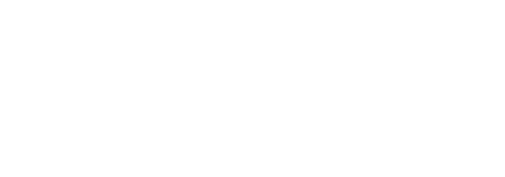

<div align="center">



[](https://git.io/typing-svg)

</div>

<br>

### 👨‍💻 About Me

```typescript
const akshay = {
    role: "Senior Software Developer",
    location: "India 🇮🇳",
    code: ["Java", "Python", "C#", "JavaScript", "TypeScript"],
    plm: ["Oracle Cloud PLM", "Agile PLM", "OIC"],
    technologies: {
        frontEnd: ["React", "HTML5", "CSS3", "Tailwind"],
        backEnd: ["Spring Boot", ".NET", "FastAPI", "Flask", "Node.js"],
        aiAndData: ["LLM integration", "Analytics", "Data visualization"],
        cloud: ["Oracle Cloud", "Google Cloud", "Docker", "Nginx"]
    },
    currentFocus: "Building useful, scalable cloud and AI products",
    funFact: "I debug with console.log() 🐛"
};
```

---

<div align="center">

## 🚀 What I Build

</div>

I enjoy turning complex problems into software that is understandable, useful, and ready to run:

- AI-assisted products that turn data into practical decisions.
- Full-stack applications with responsive interfaces and dependable APIs.
- Analytics and visualizations that make patterns easier to explore.
- Cloud deployments with clear build, runtime, and operational boundaries.

## ⭐ Selected Projects

| Project | What it demonstrates |
| --- | --- |
| [RiskSense AI](https://github.com/Ak-Nobelwolf/RiskSense-AI) | Python, FastAPI, Gemini, BigQuery, Google Cloud, and Cloud Run for environmental risk intelligence. → [Live demo](https://risksense-ai-a5amadekoq-el.a.run.app) |
| [AARAKSHAKA](https://github.com/Ak-Nobelwolf/aarakshaka) | React, Flask, LLMs, bilingual analytics, maps, network graphs, and 3D visualization. → [Live demo](https://aarakshaka-kar.onslate.in) |
| [Excel Compare](https://github.com/Ak-Nobelwolf/Excel-Compare) | Java 17, Apache POI, Vite, Docker, Nginx, and Tomcat for reliable workbook comparison. |
| [Weight Tracker](https://github.com/Ak-Nobelwolf/weight-tracker) | React, TypeScript, local-first data handling, charts, and Oracle Cloud deployment. → [Live demo](https://weight.nobelwolf.gleeze.com) |
| [News-Quasar](https://github.com/Ak-Nobelwolf/News-Quasar) | React news aggregator over the Currents API — 70+ countries, 17 categories, instant search, bookmarks, dark mode, offline backup. → [Live demo](https://ak-nobelwolf.github.io/News-Quasar/) |
| [Mini-NPX](https://github.com/Ak-Nobelwolf/Mini-NPX) | C# / Avalonia (.NET 8) bioinformatics QC — CSV to log2 NPX with Westgard-style rules and auditable run history. |

---

<div align="center">

## 🛠️ My Tech Arsenal

</div>

<div align="center">

### 💻 Languages

<table>
<tr>
    <td align="center" width="96"><br>Java</td>
    <td align="center" width="96"><br>Python</td>
    <td align="center" width="96"><br>C#</td>
    <td align="center" width="96"><br>JavaScript</td>
    <td align="center" width="96"><br>TypeScript</td>
    <td align="center" width="96"><br>HTML5</td>
    <td align="center" width="96"><br>CSS3</td>
</tr>
</table>

### 🎨 Frameworks & Libraries

<table>
<tr>
    <td align="center" width="96"><br>React</td>
    <td align="center" width="96"><br>Next.js</td>
    <td align="center" width="96"><br>Spring</td>
    <td align="center" width="96"><br>.NET</td>
    <td align="center" width="96"><br>Node.js</td>
    <td align="center" width="96"><br>FastAPI</td>
    <td align="center" width="96"><br>Flask</td>
    <td align="center" width="96"><br>Tailwind</td>
</tr>
</table>

### ☁️ Cloud, Data & Tools

<table>
<tr>
    <td align="center" width="96"><br>Google Cloud</td>
    <td align="center" width="96"><br>Docker</td>
    <td align="center" width="96"><br>Nginx</td>
    <td align="center" width="96"><br>MySQL</td>
    <td align="center" width="96"><br>Git</td>
    <td align="center" width="96"><br>GitHub</td>
    <td align="center" width="96"><br>Postman</td>
    <td align="center" width="96"><br>Figma</td>
</tr>
</table>

</div>

---

<div align="center">

## 🏆 Certifications

<br>


<br>

<br>

<br>

<br>

<br>

<br>

<br>

<br>

<br>
<a href="https://catalog-education.oracle.com/pls/certview/sharebadge?id=73A24B9B2D8A7E9AED27434A57E1BBC70849A3EB0DF5D3B4A77FADC1DEE5FCFE"></a>
<br>
<a href="https://www.coursera.org/account/accomplishments/specialization/certificate/CJVYC4J99JDG"></a>

</div>

---

<div align="center">

## 📊 GitHub Analytics

<p align="center">


</p>

<p align="center">

</p>

<p align="center">

</p>

</div>

---

<div align="center">

## 💬 Random Dev Quote


</div>

---

<div align="center">

## 🤝 Let's Connect

<a href="https://linkedin.com/in/akshaytadakod" target="_blank" rel="noreferrer">

</a>
<a href="https://github.com/Ak-Nobelwolf" target="_blank" rel="noreferrer">

</a>
<a href="https://ak-nobelwolf.github.io/Personal-Portfolio/" target="_blank" rel="noreferrer">

</a>
<a href="https://mail.google.com/mail/?view=cm&fs=1&to=akshaytadakod@gmail.com" target="_blank" rel="noreferrer">

</a>

<br><br>


<br><br>

### ⚡ "Code is like humor. When you have to explain it, it's bad." – Cory House

<br>


</div>